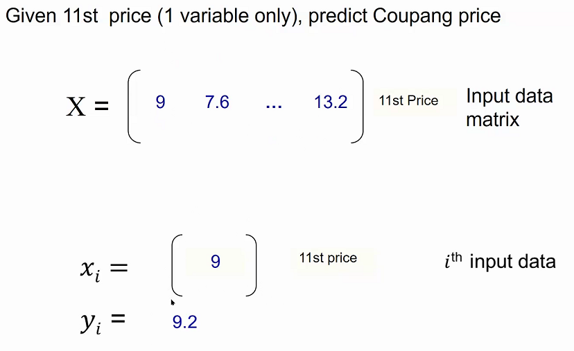
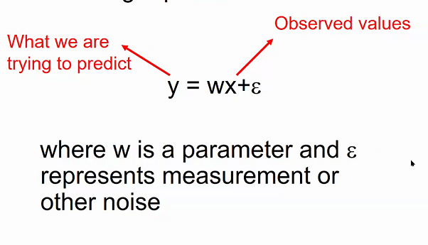

## 모델 성능 평가 이유

: 현재 상태를 알고, 언제까지 발전시킬지 알기 위해

### convex

볼록 함수

# 수학적인거 각자 정리

# 20-09-07 (2)

### cmd 창에서 python 빠져나오기

`ctrl+z`

# numpy

다차원 배열 데이터를 효과적으로 처리해 줌

---

```python
a = np.array([1, 2, 3])
type(a)
```

```
numpy.ndarray
```

---

```python
a
```

```
array([1, 2, 3])
```

---

```python
a.shape
```

```
(3,)
```

- 숫자가 1개 = a가 3개의 column 가진 1차원 배열 이라는 뜻

---

```python
c = np.array([[1,2,3],[4,5,6]])
c
```

```
array([[1, 2, 3],
       [4, 5, 6],
       [7, 8, 9]])
```

---

```python
c.shape
```

```
(3, 3)
```

- `숫자가 2개` = c가 3개의 row와 3개의 column을 가진 2차원 배열이라는 뜻

### 다차원 배열에 숫자 채우기

```python
np.ones((3,4), dtype=np.int16)
```

```
array([[0., 0., 0., 0.],
       [0., 0., 0., 0.],
       [0., 0., 0., 0.]])
```

- np.ones : 1 다차원 배열 만들기

```python
np.zeros((3,4))
```

```
array([[0., 0., 0., 0.],
       [0., 0., 0., 0.],
       [0., 0., 0., 0.]])
```

- np.zeros : 0 다차원 배열 만들기

```python
np.full((3, 4), 0.11) # 0.11로 채우기
```

```
array([[0.11, 0.11, 0.11, 0.11],
       [0.11, 0.11, 0.11, 0.11],
       [0.11, 0.11, 0.11, 0.11]])
```

- np.full : 원하는 숫자로 다차원 배열 만들기

## 간격 정해서 배열 만들기

- arange(시작점, 종료점, 간격)
- 간격을 적지 않으면 기본적으로 1씩 증가

```python
np.arange(10, 30) # 종료점 = 종료점 - 1
```

```
array([10, 11, 12, 13, 14, 15, 16, 17, 18, 19, 20, 21, 22, 23, 24, 25, 26,
       27, 28, 29])
```

- linspace(시작점, 종료점, ...)
  - num = 개수 : 출력 원하는 개수 출력
  - endpoint = True : 종료점도 포함
  - retstep = True : 간격도 출력

```python
a = np.linspace(0, 10, num=5, endpoint=True, retstep=True)
b = np.linspace(1, 10, num=5, endpoint=True, retstep=False)
c = np.linspace(0, 10, num=5, endpoint=False, retstep=False)

print("a:", a)
print("b:", b)
print("c:", c)
```

```
a: (array([ 0. ,  2.5,  5. ,  7.5, 10. ]), 2.5)
b: [ 1.    3.25  5.5   7.75 10.  ]
c: [0. 2. 4. 6. 8.]
```

## 랜덤 배열 만들기

```python
np.random.rand(2, 3)
```

```
array([[0.10684162, 0.28064948, 0.55768774],
       [0.46908127, 0.19500359, 0.26814137]])
```

## empty

shape를 만들어주고 메모리 상 가까운 값을 가지고 오고, 메모리에 어떤 값이 없다면 0에 가까운 값을 가져온다
예를들어, np.empty((2,3))을 위의 랜덤 배열을 만든 후 바로 만들면

```
array([[0.10684162, 0.28064948, 0.55768774],
       [0.46908127, 0.19500359, 0.26814137]])
```

출력

#### dim

차원 수

#### size

배열 원소의 총 개수

#### itemsize

바이트 값 반환

### reshape(row, col)

배열의 차원의 크기 변경

### 배열 거꾸로 뒤집기

[::-1]

## array와 다르게 ndarray는 배열 요소 한꺼번에 변경 가능

```python
a = np.array([1, 2, 5, 7, 8])
a[1:3] = -1
a
```

```
array([ 1, -1, -1,  7,  8])
```

## 리스트 복사

```python
a = np.array([1, 2, 5, 7, 8])
a_slice = a[1:5].copy() #원래 값이 같이 안바뀌어지도록 copy 사용하기!
```

## boolean indexing

```python
a = np.arange(12).reshape(3, 4)
rows_on = np.array([True, False, True])
a[rows_on, 1]  #a[행, 열]
```

```
array([1, 9])
```

## 연립 방정식 풀기

```
2x + 6y = 6
5x + 3y = -9
```

```python
coeffs  = np.array([[2, 6], [5, 3]]) # 계수
depvars = np.array([6, -9]) # 상수항
solution = np.linalg.solve(coeffs, depvars)
solution
```

```
array([-3.,  2.])
```

# pandas

### 딕셔너리로 Data Frame 만들기

```python
people_dict = { "weight": pd.Series([68, 83, 112], index=["alice", "bob", "charles"]),  #Series : 값과 함께 index지정이 가능
#자동 매핑 느낌
               "birthyear": pd.Series([1984, 1985, 1992], index=["bob", "alice", "charles"], name="year"), #name 은 series의 이름을 말함
               "children": pd.Series([0, 3], index=["charles", "bob"]),
               "hobby": pd.Series(["Biking", "Dancing"], index=["alice", "bob"]),}


import pandas as pd

people = pd.DataFrame(people_dict) # 딕셔너리를 표로 만들어주기
people
```

```
       weight	birthyear	children	hobby
alice	   68	    1985	NaN	       Biking
bob	   83	    1984	3.0	       Dancing
charles	   112	    1992	0.0	       NaN
```

### 조건 추출

```python
people[people["birthyear"] < 1990]
```

```
	       weight	birthyear	children	hobby
alice	       68	1985	       NaN	    Biking
bob	       83	1984	       3.0	    Dancing
```

# matplotlib

```python
import matplotlib.pyplot as plt
```

# 20-09-09 (3)

### Random Variable

확률에 의해 정해지는 결괏값들
ex) 주사위 던지기

- discrete : 죽냐/사냐
- continuous : 혈압

### Variance/standard deviation


## Gaussian

= 정규분포 (종모양)


ex) 동전 던질 때 앞면 나오는 경우

### Covariance

두 변수의 선형 관계


- 양일 때 한 개가 증가하면 다른 변수도 같이 증가하는 경우

#### 시그모이드

로지스틱, 뉴럴넷에서 사용

## Vector Norms


ex) (0,0) ~ (5,5)

- l1 : 직선 (1차원) (10 거리)
- l2 : 대각선 (2차원) (5 루트 2 거리)

### Transpose

=Symmetric


### Rank

선형적으로 독립적인 행이나 열의 수 (패턴이 없는 것)

#### Full Rank

모두 독립적

## Eigen Value

쪼개지지 않는 기본단위


## 정보 이론

- `잘 일어나지 않는 사건`이 자주 발생하는 사건보다 `정보량이 많다`라고 함
- 독립사건은 추가적인 정보량을 가짐

## 샤넌의 Entropy

1. 확률변수 X의 값이 x인 사건의 정보량
   : I(x) = -logP(x)

ex) 동전을 던져 앞면이 나오는 사건 : -log2(0.5)=1

ex) 주사위를 던져 눈이 1이 나오는 사건 : -log2(1/6) = 2.5849

2. Shannon's Entropy
   : 모든 사건 정보량의 기대값
   H(P) = E[I(x)]

ex) 앞면, 뒷면 나올 확률이 동일한 동전


## Cross Entropy


실제 분포
q
에 대하여 알지 못하는 상태에서, 모델링을 통하여 구한 분포인
p
를 통하여
q
를 예측하는 것

- 실제 값과 예측 값의 차이를 줄이기 위한 엔트로피
- 머신러닝 결과를 평가할 때 (에러가 얼마나 많은지)

## KL Divergence

- 두 확률분포의 차이를 계산
- 크로스 엔트로피 - P의 정보량

# 20-09-14

## 숙제 : 실습을 한 다음에 다음 주 실습 시간까지 자신의 dataset을 한 번 만들어본다. 노트북에 만들어서 제출.

## Univariate Regression

한 변수에 대한 예상

ex) 11번가에서 ~에 파는 물건이 쿠팡에서 얼마에 파는가?



# Linear Regression

- 파라미터와 노이즈



- 선이 예측 값, 점이 실제 값
  

- 선과 점 사이의 거리 = error
  

그래서 least squares를 쓰는 것

- 그럼 어떻게 최솟값을 구하지? = 수학적으로 : 미분


- 매트릭스에서 Linear Regression


## Linear Regression : Optimization with Gradient Descent

- online processing : 1 at a time
- batch processing : all at once

### Convex

볼록성이 한 개인 경우 (극소나 극댓값이 하나)


## Stcochastic Gradient Descent (SGD)


### 두 번 미분했더니 일직선

= convex

## Multivariate Regression

ex) 11번가와 Gmarket으로 쿠팡 값 예측


## Model Evaluation : Loss Function


## Bias and Variance


## Regularization


