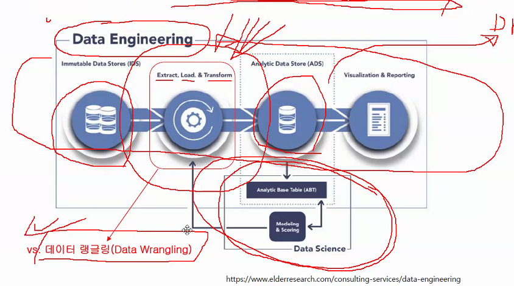

# 20-09-02 (1)

# 수업중

[강의자료](http://eshopping.co.kr/)

- Data Wrangling with Python

# 20-09-07 (2)

### 데이터 엔지니어링

- 저장(IDS, ADS), 처리 부분으로 나눌 수 있음
- ETL과 데이터 랭글링을 구분할 수 있어야

### 데이터 랭글링
raw data를 또 다른 형태로 전환하거나 매핑

#### ETL
raw data에서 extract해서 transform 하고 load해서 Data Warehouse(**표준화, 정형화** 된 정리 된 창고)로 넣기
- Data Lake : Data Warehouse가 정형화 된 데이터를 쌓는 느낌이라면, 이건 4차 산업 빅데이터 시대를 맞아 raw data를 **쌓아놓는** 창고

## Data warehouse
- 정형데이터만 저장(RDBMS 사용) => ETL 작업 필요
- 전통적 저장 시스템

## Data Lake
- 비정형, 정형 데이터 모두 저장
- Data Wrangling 작업
- 빅데이터 시대의 저장 시스템

#### 파이썬 패키지 매니저
1. pip : Python Library를 위한
2. conda : data science를 위한. R,C등 non-python 패키지도 설치 가능. Anaconda 저장소와 클라우드에서 가져옴
- 기본은 conda에서 설치. 없으면 pip에서 설치

### Anaconda Prompt
- $`conda env list` : 현재 설치 환경들 보여줌
- $`conda list` : 현재 설치된 라이브러리들 리스트 보여줌
- $`activate '환경이름'` : '환경이름'환경으로 이동

