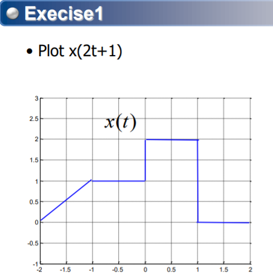

# 20-09-02 (1)

# 수업중

#### # 당분간 공지가 있을 때까지는 미팅룸 번호(170-066-2156)으로 접속

#### # 질문 : 이메일 (ecpark@dgu.ac.kr)

### # 시험 : 오프라인, 공식이나 표는 문제지에서 줌. 외울필요 없음

### # 수업 중간중간 퀴즈도 볼것

 

### 수업 계획서

# 20-09-07

# 20-09-09 (2)

## 항상 shift를 먼저! reverse나 time scaling을 나중에

# 과제 1

[HW1\_수학연습.pdf](https://github.com/i-zro/Dongguk-ICE-2020_2/files/5210700/HW1_.pdf)

