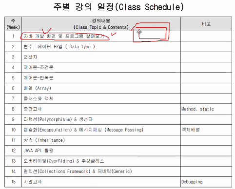
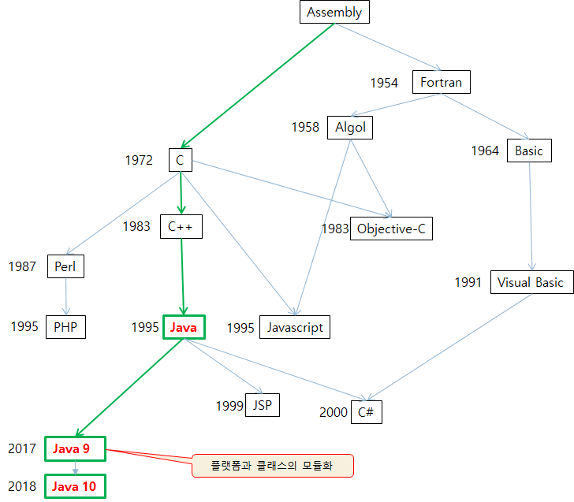
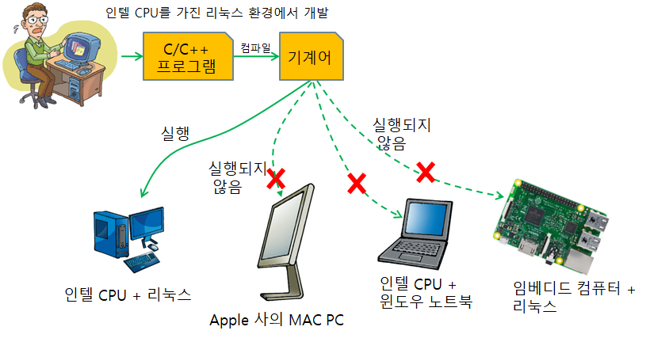
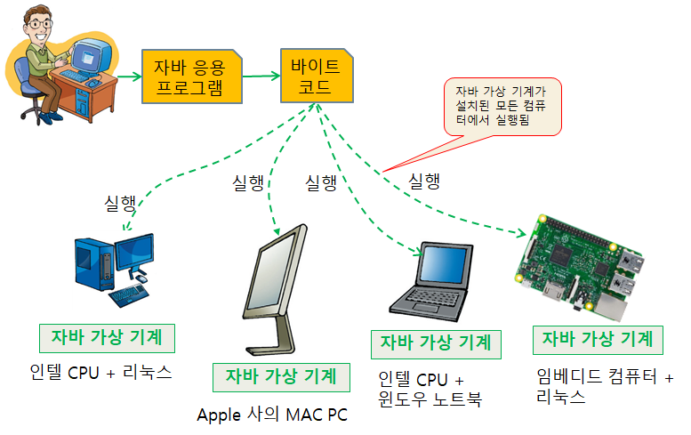

# 20-09-01 (1)

# 수업중

#### # 다음시간에 프로그래밍 환경 잡을 것

#### # 교수님 이메일 연락 : wjhan@dongguk.edu

### # 시험은 가능한 한 대면평가

### # 출석 방식 : O/X 퀴즈

### # 강의 일정

### # 강의자료

http://eshopping.co.kr/

---

#### java 탄생 배경

플랫폼에 대해 독립적인 언어가 필요하다는 요구로 java 탄생

#### 컴파일

소스 파일을 컴퓨터가 이해할 수 있는 기계어로 만드는 과정

#### JRE

개발자가 아닌 경우. 자바 실행 환경. 가상 머신만 있는 것

### JDK

[설치](http://www.oracle.com/technetwork/java/index.html)

자바 응용 개발 환경. 컴파일러 기능

### 자바 API

(Application Programming Interface)
 
[설명글 사이트](http://docs.oracle.com/javase/10/docs/api/)
 
JDK에 포함된 클래스 라이브러리 (주요한 기능들을 미리 구현한 클래스 라이브러리의 집합)

### 자바 통합 개발 환경 - 이클립스

[설치](http://www.eclipse.org/downloads/)

# 개인 복습

---
