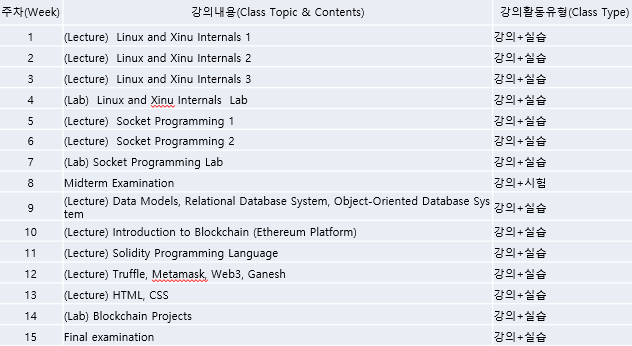
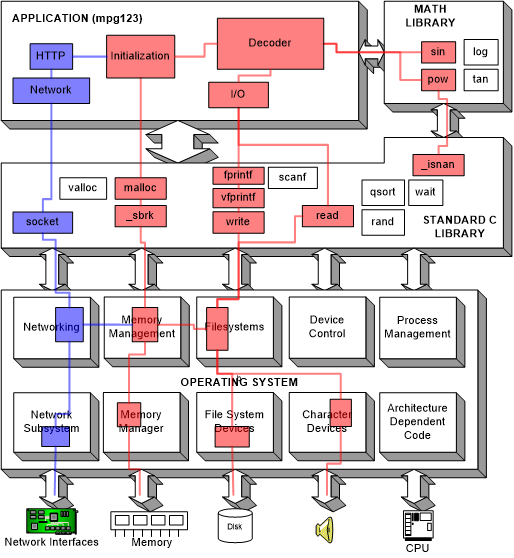
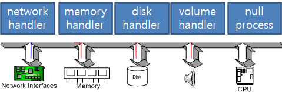

# 20-09-01 (1)

#### # 팀플조는 랜덤하게

#### # 매번 예습 동영상 올라옴

#### # 연락 : 카카오톡

### Lecture 1 Homework & Lab Assignment

<br>

### 수업 계획서



<br>

# Lecture Note 1 Introduction to Xinu

# 20-09-01 (1)

## [Video1 : Lecture Note 1 Introduction to Xinu](https://www.youtube.com/watch?v=PxMe5905_x8&feature=youtu.be)



## Multilevel Structure Of Xinu, A Hierarchial Design

### hierarchial


#### 1. Operating System Services

- Process Manager : 여러 프로그램(process) 동시에 execution 할 수 있도록
- Memory Manager : 메모리 할당
- Device Manager
- Clock (time) Manager
- File Manager
- Interprocess Communication
- Intermachine Communication
- Acoounting

#### 2. Application Programs

API = Interface To System Services

응용 프로그램에서 사용할 수 있도록, 운영 체제나 프로그래밍 언어가 제공하는 기능을 제어할 수 있게 만든 인터페이스. 주로 파일 제어, 창 제어, 화상 처리, 문자 제어 등을 위한 인터페이스 제공

.png>)

### socket

프로세스가 네트워크를 통해서 데이터를 주고받으려면 반드시 열어야 하는 창구 같은 것

#### 3. Hardware

## 멀티 태스킹

#### 1. Synchronous event loop

: 우선 순위 정하기의 문제

```c
While(1) {
	Update time-of-day clock;
	if(screen timeout has expired) {
		turn off the screen;
	}
	if(volume button is being pushed) {
		adjust volume;
	}
	if(text message has arrived) {
		Display notification for user;
	}
	…
}
```

#### 2. Asynchronous event loop



#### 3. Concurrent execution


# 20-09-03 (2)

### C 언어 library = 파이썬 package = API

## Video : [Video2 : Lecture Note 1 Xinu Virtual Machine](https://youtu.be/UowGCPFeb7Q)

### Install virtual box

[설치사이트](https://www.virtualbox.org/wiki/Downloads)

- Windows hosts
- VirtualBox 6.1.12 Oracle VM VirtualBox Extension Pack - All supported platforms

두개를 다운 받을 것

### Install xinu

[설치사이트](https://xinu.cs.purdue.edu/)

- A tar file of two appliances that consititute a Virtual Box version (the code works on Vbox 6.1.12)

얘를 받아야함

### 직렬포트 설정 변경


### 초록색 화살표로 시작


- 패스워드 : xinurocks
- 커맨드 창이 나옴

1. 내가 현재 어떤 디렉토리 안에 있는지

```
pwd
```

2. 그 디렉토리 안에 어떤 파일들이 있는지

```
ls
```

3. 현재 실행되고 있는 프로세스

```
ps
```

4. xinu로 디렉토리 옮기기

```
cd xinu
```

- 시스템 프로토콜 확인

```
ls system
```

- library 프로토콜 확인

```
ls lib
```

- tcp/ip 프로토콜 확인

```
ls net
```

- 헤더파일 프로토콜 확인

## xinu 이미지 수정하기

```
cd xinu
```

```
cd compile/
```

```
ls
```

```
make clean
```

해주고 다시

```
make
```

그러면 xinu.elf 파일 생성!

### grep

입력으로 전달된 파일의 내용에서 특정 문자열을 찾고자할때 사용

### tftp

간단한 파일 전송 프로토콜

```
grep tftp Makefile
```

```
ls /srv/tftp/
```

해주면 xinu.boot 파일(이미지) 생성!

## 그 이미지를 backend에서 실행하기

```
sudo minicom
```

- 패스워드 입력
- backend 실행
  
- sudo apt-get update
- sudo apt-get install ctags

# 비디오 렉처노트 2


