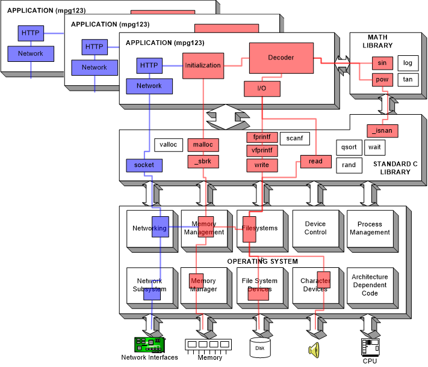

# 20-09-01 (1)

# 수업중

#### # 팀플조는 랜덤하게

#### # 매번 예습 동영상 올라옴

#### # 연락 : 카카오톡

### Lecture 1 Homework & Lab Assignment

<br>

### 수업 계획서


# 개인 복습

---

# Lecture Note 1 Introduction to Xinu

## [Video : Lecture Note 1 Introduction to Xinu](https://www.youtube.com/watch?v=PxMe5905_x8&feature=youtu.be)


### Multilevel Structure Of Xinu, A Hierarchial Design

#### 1. Operating System Services

- Process Manager : 여러 프로그램(process) 동시에 execution 할 수 있도록
- Memory Manager : 메모리 할당
- Device Manager
- Clock (time) Manager
- File Manager
- Interprocess Communication
- Intermachine Communication
- Acoounting

#### 2. Application Programs(API = Interface To System Services)

응용 프로그램에서 사용할 수 있도록, 운영 체제나 프로그래밍 언어가 제공하는 기능을 제어할 수 있게 만든 인터페이스. 주로 파일 제어, 창 제어, 화상 처리, 문자 제어 등을 위한 인터페이스 제공
.png>)

#### 3. Hardware

### 멀티 태스킹

#### 1. Synchronous event loop

: 우선 순위 정하기의 문제

```c
While(1) {
	Update time-of-day clock;
	if(screen timeout has expired) {
		turn off the screen;
	}
	if(volume button is being pushed) {
		adjust volume;
	}
	if(text message has arrived) {
		Display notification for user;
	}
	…
}
```

#### 2. Asynchronous event loop


#### 3. Concurrent execution



## Video : [Video : Lecture Note 1 Xinu Virtual Machine](https://youtu.be/UowGCPFeb7Q)

### Install virtual box

[설치사이트](https://www.virtualbox.org/wiki/Downloads)

- Windows hosts
- VirtualBox 6.1.12 Oracle VM VirtualBox Extension Pack - All supported platforms

두개를 다운 받을 것

### Install xinu

[설치사이트](https://xinu.cs.purdue.edu/)

- A tar file of two appliances that consititute a Virtual Box version (the code works on Vbox 6.1.12)

얘를 받아야함
